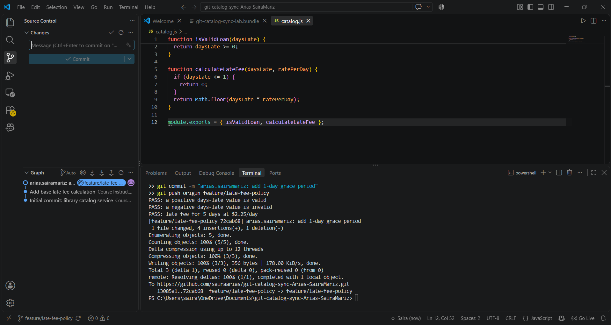
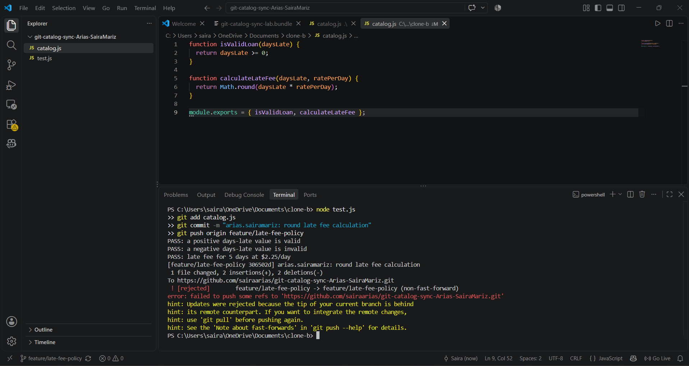
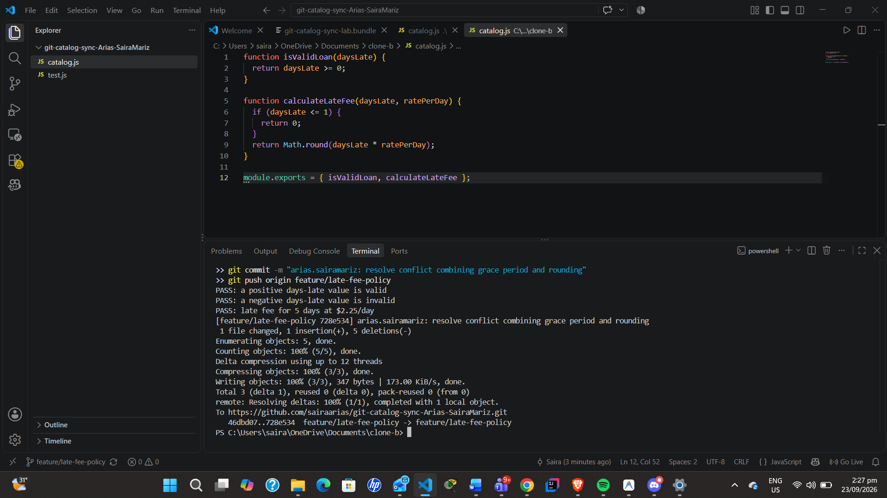
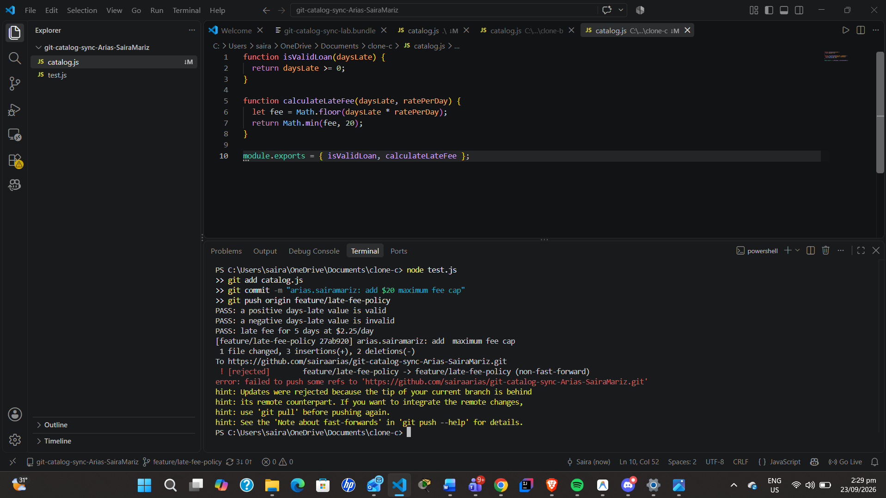
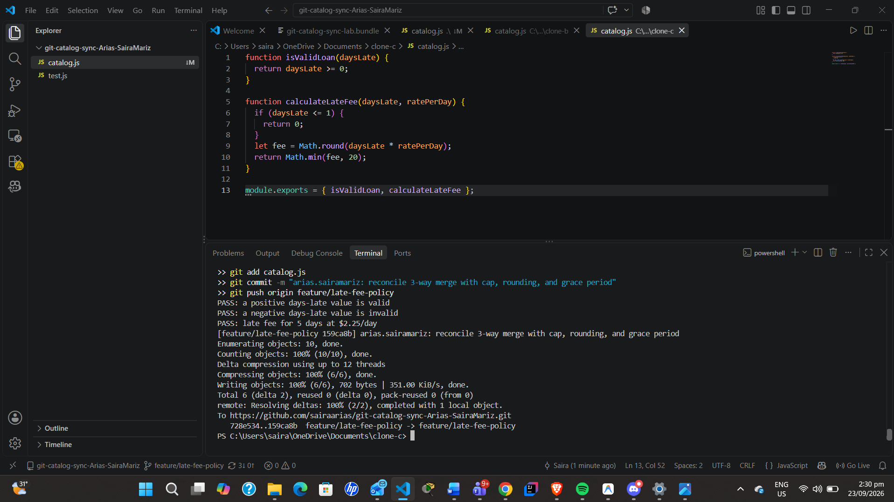
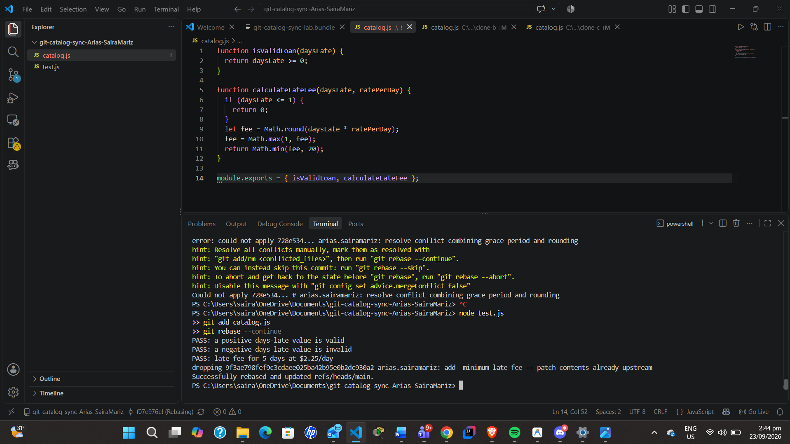
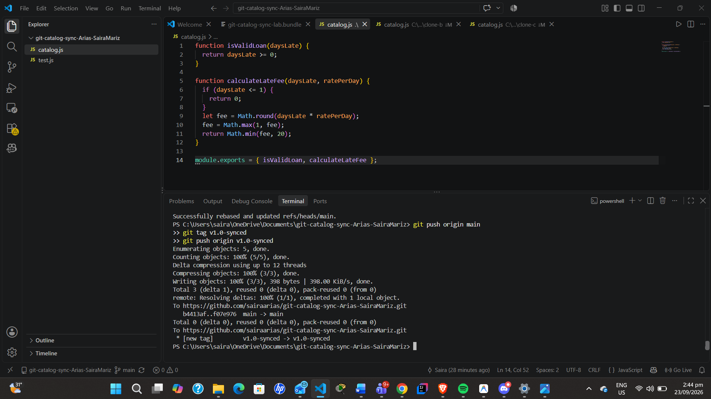

# Git Catalog Sync Lab Workflow

## 1. Walkthrough of calculateLateFee

```javascript
function calculateLateFee(daysLate, ratePerDay) {
  if (daysLate <= 1) {
    return 0;
  }
  let fee = Math.round(daysLate * ratePerDay);
  fee = Math.max(1, fee);
  return Math.min(fee, 20);
}
```

* **1-Day Grace Period (`if (daysLate <= 1) return 0;`)**: Implemented by **Clone A** in Task 1 to waive fees for returns within one day.
* **Rounding Logic (`Math.round(...)`)**: Implemented by **Clone B** in Task 2 to replace truncation with nearest-integer rounding.
* **$1 Minimum Fee (`fee = Math.max(1, fee);`)**: Implemented by **Clone A** in Task 6 to ensure any late return past the grace period incurs at least a baseline $1 charge.
* **$20 Fee Cap (`return Math.min(fee, 20);`)**: Implemented by **Clone C** in Task 4 to restrict the maximum late fee from exceeding $20.

---

## 2. Two-Way vs. Three-Way Conflict Comparison

Task 3 involved a two-way conflict between two branches originating from the exact same base commit (Clone A's grace period vs. Clone B's rounding). In Task 5, Clone C faced a three-way conflict where the remote branch had already undergone a prior merge combining two independent changes, while Clone C introduced a third feature ($20 cap). This was harder because Clone C had to resolve multiple layers of upstream history at once, ensuring the correct logical sequence of all three business rules without discarding earlier resolutions.

---

## 3. Merge vs. Rebase Reconciliations

* **Task 5 (Merge)**: Created a new merge commit with two separate parent commits, preserving the non-linear branch history and explicitly documenting the point where Clone C integrated remote work.
* **Task 6 (Rebase)**: Rewrote project history by detaching Clone A's commit, fast-forwarding the base to the remote branch tip, and reapplying the commit on top. This created a completely linear history without an extra merge commit.

---

## 4. Process Change to Prevent Rejected Pushes

Adopting a **Feature Branch / Pull Request (PR)** workflow would have prevented all three rejected pushes. Instead of multiple team members committing directly to a single shared branch (`feature/late-fee-policy`), each contributor would work in an isolated sub-branch (e.g., `feature/grace-period`, `feature/rounding`, `feature/fee-cap`) and submit a Pull Request. Branch protection rules and automated CI tests would ensure sequential, conflict-free merges.

---

## Screenshot Evidence

### Task 1


### Task 2 (Rejected Push)


### Task 3 (Merge Resolution)


### Task 4 (Rejected Push)


### Task 5 (3-Way Merge Resolution)


### Task 6 (Rebase Rejected & Resolution)


### Task 7 (Main Merge & Tag)
